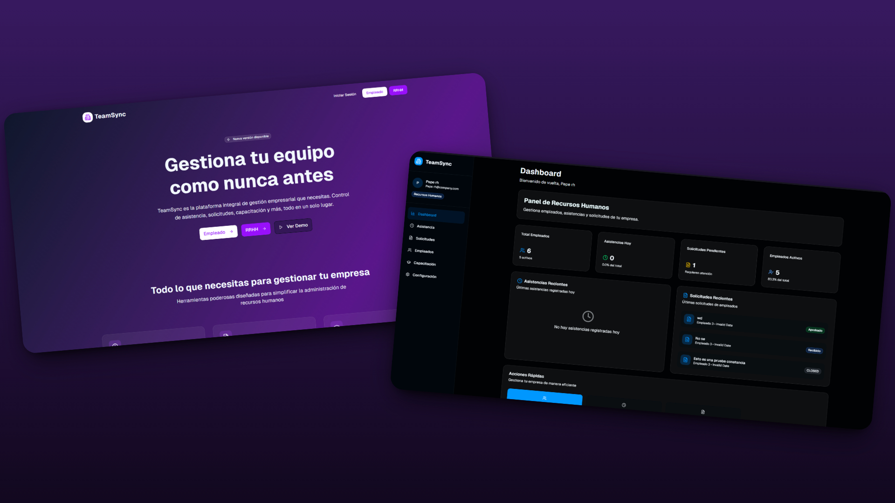

# TeamSync - Proyecto Final IDS

Sistema de microservicios para la gestión integral de empresas, empleados, asistencias, solicitudes y capacitaciones.

## Tabla de Contenidos

- [Arquitectura del Sistema](#arquitectura-del-sistema)
- [Requisitos de Instalación](#requisitos-de-instalación)
- [Configuración de Base de Datos](#configuración-de-base-de-datos)
- [Instalación y Configuración](#instalación-y-configuración)
- [Orden de Ejecución de Microservicios](#orden-de-ejecución-de-microservicios)
- [Endpoints Principales](#endpoints-principales)

## Arquitectura del Sistema

### Microservicios

| Microservicio | Puerto | Base de Datos | Puerto DB | Descripción |
|---------------|--------|---------------|-----------|-------------|
| **eureka-server** | 8761 | - | - | Servidor de descubrimiento de servicios |
| **gateway** | 8090 | - | - | API Gateway con enrutamiento y autenticación |
| **ms-auth** | 8086 | auth | 3311 | Autenticación y autorización (JWT) |
| **ms-companies** | 8085 | companies | 3306 | Gestión de empresas y departamentos |
| **ms-employees** | 8081 | employees | 3307 | Gestión de empleados |
| **ms-attendance** | 8082 | ms_attendance | 3308 | Control de asistencias |
| **ms-requests** | 8083 | ms_requests | 3310 | Gestión de solicitudes |
| **ms-training** | 8084 | ms_training | 3309 | Gestión de capacitaciones |

### Tecnologías Utilizadas

- **Backend**: Spring Boot 3.5.5, Spring Cloud 2025.0.0
- **Base de Datos**: MySQL 8.0
- **Autenticación**: JWT (JSON Web Tokens)
- **Comunicación**: OpenFeign, Eureka Discovery
- **Mapeo**: MapStruct
- **Validación**: Jakarta Validation
- **Build**: Maven

## Requisitos de Instalación

### Software Requerido

- **Java 17** o superior
- **Maven 3.6+** (o usar Maven Wrapper incluido)
- **MySQL 8.0** (o Docker)
- **Git**

### Herramientas Recomendadas

- **IDE**: IntelliJ IDEA, Eclipse, o VS Code
- **Base de Datos**: MySQL Workbench (alternativa a Docker)
- **API Testing**: Postman, Insomnia, o curl
- **Docker Desktop** (opcional, para bases de datos)

## FrontEndPreview




## Configuración de Base de Datos

### Opción 1: Docker (Recomendado)

```bash
# Navegar al directorio docker
cd docker

# Levantar todas las bases de datos
docker-compose up -d

# Verificar que estén corriendo
docker ps
```

### Opción 2: MySQL Workbench

Si prefieres usar MySQL Workbench en lugar de Docker:

1. **Instalar MySQL Server 8.0**
2. **Crear las siguientes bases de datos:**

```sql
-- Conectar a MySQL como root
CREATE DATABASE companies;
CREATE DATABASE employees;
CREATE DATABASE ms_attendance;
CREATE DATABASE ms_training;
CREATE DATABASE ms_requests;
CREATE DATABASE auth;

-- Configurar usuario (opcional)
CREATE USER 'worky_user'@'localhost' IDENTIFIED BY 'Alonso1106';
GRANT ALL PRIVILEGES ON *.* TO 'worky_user'@'localhost';
FLUSH PRIVILEGES;
```

3. **Configurar conexiones en MySQL Workbench:**
   - `companies`: localhost:3306
   - `employees`: localhost:3307 (cambiar puerto en MySQL)
   - `ms_attendance`: localhost:3308
   - `ms_training`: localhost:3309
   - `ms_requests`: localhost:3310
   - `auth`: localhost:3311

## Instalación y Configuración

### 1. Clonar el Repositorio

```bash
git clone https://github.com/wonderiing/teamsync
cd worky-ids-proyectofinal
```

### 2. Configurar Base de Datos

**Con Docker:**
```bash
cd docker
docker-compose up -d
```

**Con MySQL Workbench:**
- Crear las bases de datos mencionadas arriba
- Ajustar puertos si es necesario

### 3. Compilar Proyectos

```bash
# Compilar todos los microservicios
./mvnw clean compile -DskipTests

# O compilar individualmente
cd eureka-server && ./mvnw clean compile
cd ../gateway && ./mvnw clean compile
cd ../ms-auth && ./mvnw clean compile
cd ../ms-companies && ./mvnw clean compile
cd ../ms-employees && ./mvnw clean compile
cd ../ms-attendancce && ./mvnw clean compile
cd ../ms-requests && ./mvnw clean compile
cd ../ms-training && ./mvnw clean compile
```

## Orden de Ejecución de Microservicios

**¡IMPORTANTE!** Los microservicios DEBEN ejecutarse en el siguiente orden:

### 1. Base de Datos (Primero)
```bash
# Con Docker
cd docker && docker-compose up -d

# Con MySQL Workbench
# Asegúrate de que MySQL esté corriendo y las bases de datos creadas
```

### 2. Eureka Server (Segundo)
```bash
cd eureka-server
./mvnw spring-boot:run
```
**Esperar a que aparezca:** `Started EurekaServerApplication`

### 3. Microservicios de Negocio (Tercero)
```bash
# En terminales separadas, ejecutar en este orden:

# 1. ms-companies
cd ms-companies
./mvnw spring-boot:run

# 2. ms-employees  
cd ms-employees
./mvnw spring-boot:run

# 3. ms-auth
cd ms-auth
./mvnw spring-boot:run

# 4. ms-attendance
cd ms-attendancce
./mvnw spring-boot:run

# 5. ms-requests
cd ms-requests
./mvnw spring-boot:run

# 6. ms-training
cd ms-training
./mvnw spring-boot:run
```

### 4. API Gateway (Último)
```bash
cd gateway
./mvnw spring-boot:run
```

### Verificación del Sistema

1. **Eureka Dashboard**: http://localhost:8761
2. **API Gateway**: http://localhost:8090
3. **Health Check**: http://localhost:8090/api/v1/auth/health

## 🔗 Endpoints Principales

### Autenticación (ms-auth)
- `POST /api/v1/auth/register/employee` - Registro de empleado
- `POST /api/v1/auth/register/hr` - Registro de HR
- `POST /api/v1/auth/register/admin` - Registro de Admin
- `POST /api/v1/auth/login` - Login general
- `POST /api/v1/auth/login/employee` - Login empleado
- `POST /api/v1/auth/login/hr` - Login HR
- `POST /api/v1/auth/login/admin` - Login Admin

### Empresas (ms-companies)
- `GET /api/v1/companies` - Listar empresas
- `POST /api/v1/companies` - Crear empresa
- `GET /api/v1/departments` - Listar departamentos
- `POST /api/v1/departments` - Crear departamento

### Empleados (ms-employees)
- `GET /api/v1/employees` - Listar empleados
- `POST /api/v1/employees` - Crear empleado
- `GET /api/v1/employees/{id}` - Obtener empleado
- `GET /api/v1/employees/my-profile` - Mi perfil

### Asistencias (ms-attendance)
- `POST /api/v1/attendances/check-in` - Check-in
- `POST /api/v1/attendances/check-out` - Check-out
- `GET /api/v1/attendances/my-attendances` - Mis asistencias

### Solicitudes (ms-requests)
- `POST /api/v1/requests` - Crear solicitud
- `GET /api/v1/requests/my-requests` - Mis solicitudes
- `PUT /api/v1/requests/{id}/status` - Aprobar/Rechazar

### Capacitaciones (ms-training)
- `GET /api/v1/tutorials` - Listar tutoriales
- `POST /api/v1/tutorials` - Crear tutorial
- `GET /api/v1/tutorials/categories` - Categorías


